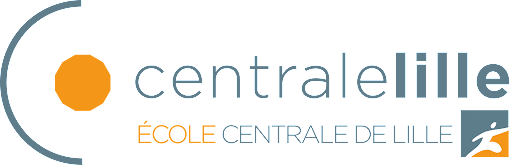

I am currently a master student of data science. This master program is supported by the [University of Lille](https://www.univ-lille.fr/) (3 Departments: computer science, mathematics, electrical engineering) as well as 2 renowned engineering schools (Grandes Ecoles): [Centrale Lille](https://centralelille.fr/) and [IMT Nord-Europe](https://imt-nord-europe.fr/en/).

I received the Bachelor degree in Computer Science from University of Lille, Lille, France, in June 2021.

   
